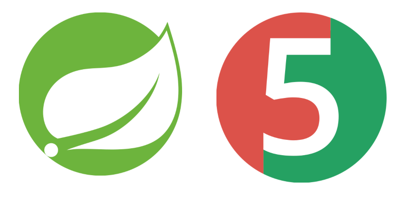
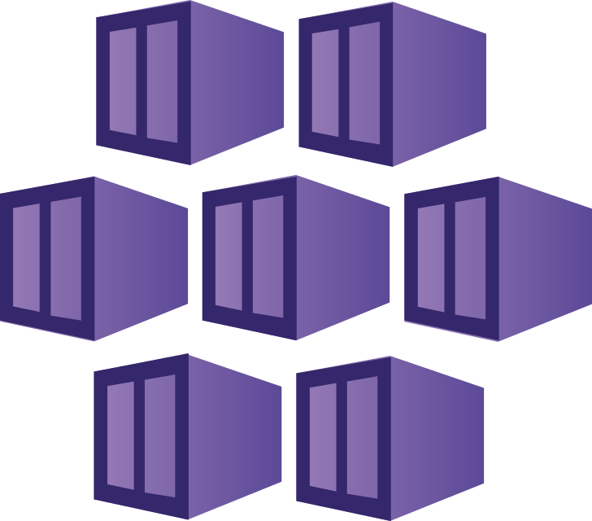

<!-- Banner -->

  

<!-- Role pills — trailing spacer equalizes row so Systems Builder sits at row center -->

  
  
  
  

<!-- Status pill -->

  

<!-- Typing headline -->

  

<!-- Socials + profile views -->

  
  

  

<!-- Animated section heading: About -->

  

- Ship across the stack -> **Java / Springboot** backends, **Angular** frontends, **SQL** contracts.
- Deliver -> Secured backend systems end-to-end, from API design to production deploys.
- 🟢 **Open to work** -> Java 8/11/17/21+, SQL/NoSQL, Building Scalable & Cloud-Native Applications
- Portfolio -> **[Yash's Digital Hub](https://yashwanthgundagani.netlify.app/)**
- LinkedIn -> **[Yashwanth Gundagani](https://www.linkedin.com/in/yashwanthgundagani)**

  

<!-- Animated section heading: Tech -->

  

<!-- Backend stack main -->

  
  
  
  
  

<!-- Frontend-->

  
  

<!-- Databases -->

  
  
  

<!-- Other Tools -->

  
  
  
  &nbsp;
  
  &nbsp;
  

<!-- DevSecOps Stack -->

  
  
  
  
  

<!-- Monitoring & Daily workflows -->

<!-- DevOps / Cloud -->

  
  &nbsp;
  

  

<!-- Animated section heading: GitHub stats -->

  

  

  

<!-- Animated section heading: Activity -->

  

  

  

  

